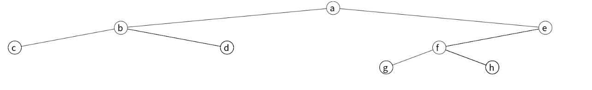
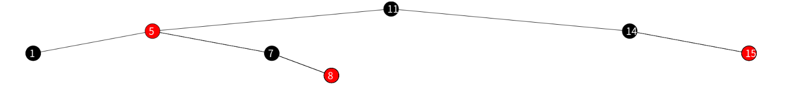

# binary-tree-visualization

Given the pre-order traversal sequence (including all empty encounters), this JavaScript program can paint the binary tree in the browser. Each non-empty node is denoted by an positive integer, and each empty node is denoted by the character '#'.

For example, if you give the following input (the first number is used to determine the size of the nodes),

> 32

> 1 2 3 # # 4 # # 5 6 7 # # 8 # # #

you will get this result:

# modification after fork

- Characters other than ' ' and '#' are supported

> a b c # # d # # e f g # # h # # #

- You can change the background color of node

> 11(black) 5(red) 1(black) # # 7(black) # 8(red) # # 14(black) # 15(red) # # 

